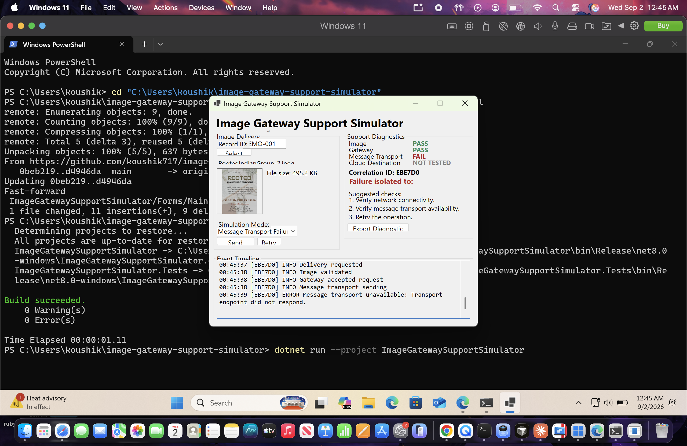
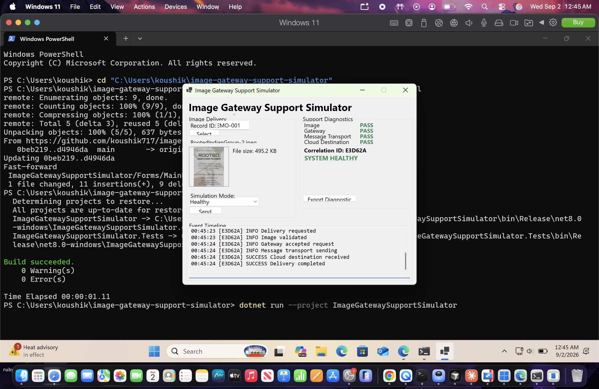
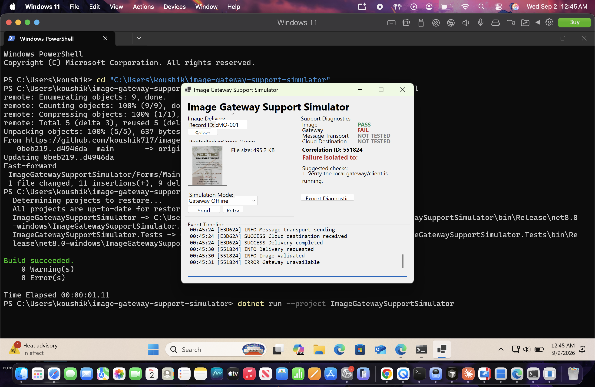

# Image Gateway Support Simulator

A small C#/.NET Windows Forms learning project that simulates a local
image-delivery workflow and explores support diagnostics.

## Demo



Example of a simulated message transport failure. The diagnostic panel shows
which stages were reached successfully and leaves the downstream cloud
destination as NOT TESTED because the operation never reached that layer.

## Architecture

```
Local Image
    |
WinForms Client
    |
Gateway Service
    |
Message Transport
    |
Mock Cloud Destination
```

The message transport and cloud destination are simulated in-process. There
is no real networking, messaging provider, or cloud dependency involved.

## Features

- Local image selection and preview
- Async simulated delivery, with the UI staying responsive throughout
- Gateway abstraction (`GatewayService`)
- Message transport abstraction (`IMessageTransport`)
- Correlation IDs to trace a single delivery attempt end to end
- A live event timeline of each stage
- A support diagnostics panel showing PASS / FAIL / NOT TESTED per layer
- Retry after a failed attempt
- Exportable plain-text support report

## Failure Simulation

Three simulation modes are available: Healthy, Gateway Offline, and Message
Transport Failure. Each fails at a different, distinguishable point in the
pipeline, so the diagnostics panel can show exactly which layer - Image,
Gateway, Message Transport, or Cloud Destination - a delivery attempt got to
before failing, plus a short list of suggested checks.

NOT TESTED is intentionally different from FAIL: it means the operation
stopped at an earlier layer, so the downstream component was never reached.

A bad request (for example, a missing Record ID) is also handled and reported
separately from an actual Gateway Offline failure, since the request never
meaningfully reaches the simulated gateway in that case.

### Healthy Flow



All simulated stages complete successfully.

### Gateway Offline



The image is validated, but the simulated local gateway is unavailable.
Message transport and cloud destination remain NOT TESTED because the
request stops at the gateway.

## What I Learned

- WinForms event-driven programming
- keeping the UI thread responsive with async/await
- resource management for local images (avoiding file locks, disposing
  bitmaps)
- separating UI code from service/business logic
- a basic message-based communication pattern behind an interface
- correlation IDs for tracing one operation across multiple stages
- thinking about failures in terms of which layer they belong to

## How to Run (Windows)

This is a WinForms application and requires Windows with the .NET 8 SDK
installed. Manually verified on Windows 11 with .NET 8.

```bash
dotnet run --project ImageGatewaySupportSimulator
```

A small test project covers `GatewayService` directly, without touching
WinForms:

```bash
dotnet test
```

## Scope and Limitations

This is a learning project, not production software. The gateway,
message transport, and cloud destination are simulated. The project
does not connect to any real messaging provider, cloud service,
healthcare system, or external application.
